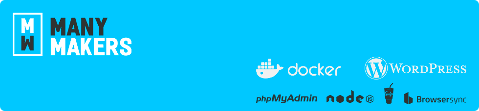

# Many Makers | WordPress Docker
> Base para desenvolvimento de sites em Wordpress utilizada pela equipe da [Many Makers](http://manymakers.digital). 
> Este projeto está configurado para utilizar o Gulp para compilar o arquivos SASS e compactar os arquivos JS.
> Outro ponto positivo deste projeto é a agilidade no desenvolvimento utilizando os recursos do BrowserSync.

### Pré-requisitos
Você deverá ter o [Docker Toolbox para macOS](https://docs.docker.com/toolbox/toolbox_install_mac) instalado em sua máquina.

> **Importante: Este projeto só foi testado em máquinas utilizando o Toolbox**

## Instalando o Projeto
Para iniciar o projeto você deverá clonar o repositório em sua máquina.
**É importante definir o nome do projeto no final do comando Git**

```shell
git clone https://gitlab.com/rickgomes/many_makers_wordpress.git nome_do_projeto
```
A estrutura do projeto será a seguinte:

```
nome_do_projeto
└───public
│   └───languages
│   └───plugins
│   └───themes
│	└───upgrade
│	└───uploads
└───readme
│   └───readme.png
│   docker-compose.yml
│   Dockerfile
│   gulpfile.js
│   package.json
│   README.md
│   wordpress.sh
```
É necessário realizar a criação da pasta do tema que será desenvolvido dentro de **themes**.
Caso já tenha os plugins em sua máquina poderá mover para o diretório **plugins**
Você poderá deletar os arquivos e pastas **readme** após a instalação.

## Desenvolvimento
### Conteúdo do Projeto
- [Docker Toolbox para macOS](https://docs.docker.com/toolbox/toolbox_install_mac)
- [WordPress](https://wordpress.org/)
- [NodeJS](https://nodejs.org/)
- [Gulp](https://gulpjs.com/)
- [BrowserSync](http://browsersync.io)
- [phpMyAdmin](https://www.phpmyadmin.net/)

### Iniciando as configurações
Antes de realizar a construção do no Docker é necessário realizar as configurações no **host** da máquina.
Digite no terminal o comando sudo `sudo nano /etc/hosts` e adicione `192.168.99.100  local.dev`.
**É necessário definir o domínio que será utilizado pois com ele você irá acessar o projeto (recomendável utilizar a extensão .dev)**
Por padrão o Docker Machine define o IP 192.168.99.100. Caso não for será necessário editar a linha 14 do `gulpfile.js`.

Após esta configuração, dentro da pasta do projeto no termninal executar o comando:

```
docker-compose build
```

Após a construção da imagens do projeto é basta iniciar.

```
docker-compose up -d
```
Ao subir o seu projeto utilizando o Docker será criada a pasta `mysql` ao seu projeto onde irá salvar todas as informações do banco de dados **MYSQL**.

#### Configurações SASS
Dentro da pasta do tema que será desenvolvido deverá conter uma pasta chamada `sass`, ficando **public/themes/nome_do_projeto/sass/**.
Todos os arquivos criados nesta pasta são compilados em um arquivo chamado **style.scss** e enviados para o arquivo **public/themes/nome_do_projeto/style.css**.
Caso utilizar múltiplos arquivos sass é necessário realizar o import dentro do arquivo style.scss utilizando o comando `@import`.

#### Configurações JS
Dentro da pasta do tema que será desenvolvido deverá conter uma pasta chamada `js`, ficando **public/themes/nome_do_projeto/js/**.
Todos os arquivos criados nesta pasta são compilados em um arquivo chamado **scripts.js** e enviados para o arquivo **public/themes/nome_do_projeto/scripts.js**.

### phpMyAdmin
Acessando a porta `8081` do seu projeto você poderá realizar qualquer modificação necessária, visualizar informações ou exportar a base de dados.
O usuário e senha padrão utilizados para acessar são:
> - Usuário: root
> - Senha: root

## Versões
Versões das imagens Docker utilizadas:
> - mysql
> - phpmyadmin
> - php:7.0-apache

Wordpress sempre será a última versão disponível.
Node utilizando a última versão 8.*